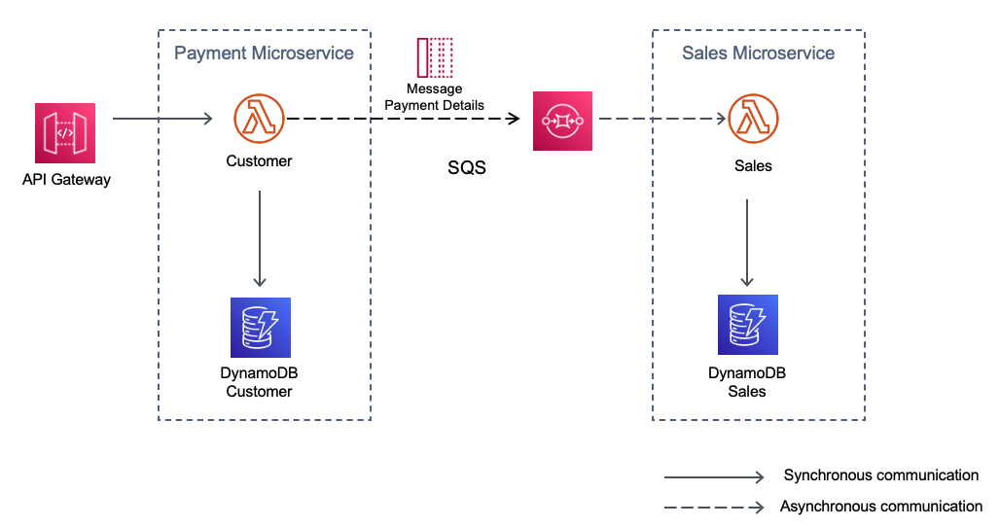

## Integrating microservices by using AWS serverless services
## Decouple messaging pattern - Asynchronous Communication

This is a Java implementation of the Decouple messaging pattern as described in the official AWS documentation
https://docs.aws.amazon.com/prescriptive-guidance/latest/modernization-integrating-microservices/decouple-messaging.html

Topology


## Description

The communication style in this pattern is asynchronous.
The Customer Service sends a message to an SQS queue and does not expect any response from the Sales Service(fire-and-forget model).
The SQS queue will trigger the Sales Service whenever there are new messages in the queue.
The Sales Service is responsible for consuming the messages from the queue.

The SAM template contains all the information to deploy AWS resources and also the permission required by these service to communicate.

You will be able to create and delete the CloudFormation stack using AWS SAM.

This is fully functional example implemented in Java 11.

Important: this application uses various AWS services and there are costs associated with these services after the Free Tier usage - please see the AWS Pricing page for details. You are responsible for any AWS costs incurred.

## Language:
#### This is a Maven project which uses Java 11 and AWS SDK

## Framework
The framework used to deploy the infrastructure is SAM

## Services used

The AWS services used in this pattern are
#### API Gateway - AWS Lambda - DynamoDB - Amazon SQS

## Deployment commands

````
mvn clean package

# create an S3 bucket where the source code will be stored:
aws s3 mb s3://nh9d8122nldaksjd9022dwd

# upload the source code to S3:
aws s3 cp target/sourceCode.zip s3://nh9d8122nldaksjd9022dwd

# SAM will deploy the CloudFormation stack described in the template.yml file:
sam deploy --s3-bucket nh9d8122nldaksjd9022dwd --stack-name messaging-pattern --capabilities CAPABILITY_IAM

````

## Testing

To test the endpoint first send data using the following command. Be sure to update the endpoint with endpoint of your stack.

```

# Copy the API Gateway URL for the Payments endpoint from the sam deploy outputs
#  i.e. 
# Outputs                                                                                                                                                                                                                             
# -------------------------------------------------------------------------------------------------------------------------------------------------------------------------------------------------------------------------------------
# Key                 PaymentsEndpoint                                                                                                                                                                                                      3
# Description         API Gateway Payments Endpoint                                                                                                                                                 
# Value               https://______________/prod/payments


# Call the API Gateway 

curl -X POST https://API_GATEWAY_URL -H "Content-Type: application/json" -d '{"customerId": "111-222","customerFullName":"John Smith","customerEmail": "john.smith@example.com","amount": "9.99","product": "car insurance"}' 

# you should receive an email with the information
# and also see in the console the paymentId
# i.e. {"paymentId":"7a6013d7-8f9e-4ffa-9961-96c18136997c"}

# Scan the DynamoDB CustomerPayments 
aws dynamodb scan --table-name CustomerPayments

# Scan the DynamoDB Sales 
aws dynamodb scan --table-name Sales    
```

## Cleanup

Run the given command to delete the resources that were created. It might take some time for the CloudFormation stack to get deleted.
```
aws cloudformation delete-stack --stack-name messaging-pattern

aws s3 rm s3://nh9d8122nldaksjd9022dwd --recursive

aws s3 rb s3://nh9d8122nldaksjd9022dwd
```

## Requirements

* [Create an AWS account](https://portal.aws.amazon.com/gp/aws/developer/registration/index.html) if you do not already have one and log in. The IAM user that you use must have sufficient permissions to make necessary AWS service calls and manage AWS resources.
* [AWS CLI](https://docs.aws.amazon.com/cli/latest/userguide/install-cliv2.html) installed and configured
* [Git Installed](https://git-scm.com/book/en/v2/Getting-Started-Installing-Git)
* [AWS Serverless Application Model](https://docs.aws.amazon.com/serverless-application-model/latest/developerguide/serverless-sam-cli-install.html) (AWS SAM) installed


## Author bio
Razvan Minciuna
https://www.linkedin.com/in/razvanminciuna/


